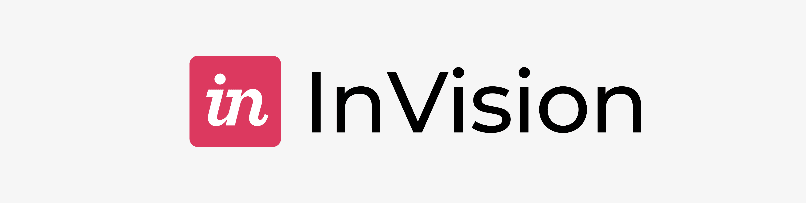
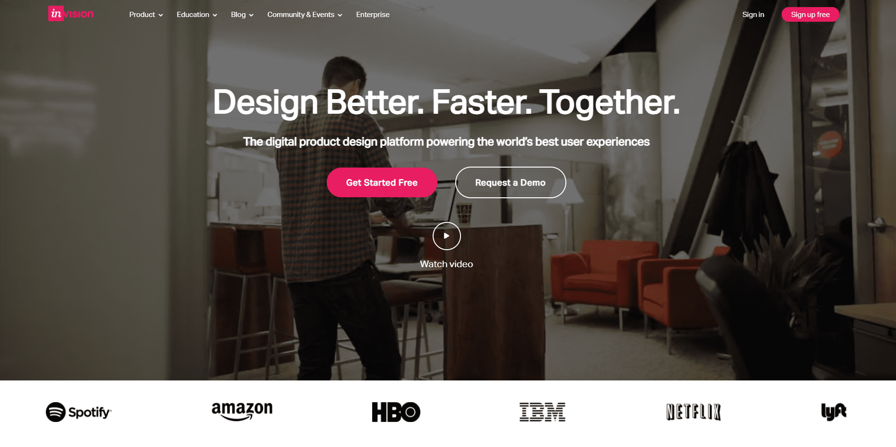

# 🍒 Invision App



## Front-end integration / reproduction project via a defined model.

## ✏️ Description

**Invision App** is a responsive copy of the famous digital product design platform: **InVision** maked using React.js<br/>
Fully responsive website <br/>
Upload with Vercel

## ⚡️ Overview



## 🔥 Experience

This web application allowed me to discover React.js with the integration of an already existing website.
Due to this reproduction, I was able to confront real design and integration issues. I was able to overcome these difficulties with a deeper understanding of CSS. I was also able to enhance my responsive design skills.

## ⚙️ Techno used

  

## 🔧 Install

```
git clone https://github.com/Greepsu/Invision-Landing-Page
cd weather-app
npm start
```

## 💻 Links

Official InVision website: https://www.invisionapp.com <br/>
Application: https://weather-app-eight-neon.vercel.app <br/>
Github: https://github.com/Greepsu/Invision-Landing-Page
